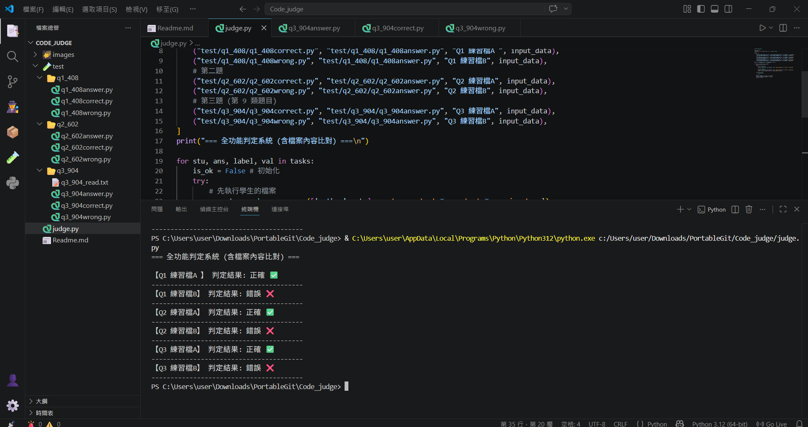

# OmniJudge: 大數據全功能判定系統 (Code Judger)

這是我的自製程式碼評判工具，主要用於自動化驗證 Python 腳本的輸出結果，特別加強了對 File I/O 的支援。

## 簡介 (Introduction)
本系統專門解決手動對答案的繁瑣過程，透過 `subprocess` 模組執行程式並捕捉輸出，能快速驗證程式邏輯的正確性。

## 功能 (Key Features)
* **Dual Mode**: 支援 `text` (標準輸出) 與 `file` (外部檔案寫入) 比對。
* **Safety**: 設定 `timeout` 機制，避免學生程式陷入死迴圈。
* **Automation**: 自動清理測試產生的 `write.txt` 暫存檔。

## 套件列表 (Dependencies)
- **Python** (3.10+)
- **Subprocess** (Built-in)
- **OS** (Built-in)

## 成果 (Demo Results)

[專案操作演示影片](你的影片連結)

## 補充工具：Batch Rename Tool
我也開發了一個批次重命名工具，用於將學生的作業檔名 **Standardize** (標準化)，以便 Judger 進行批次判定。這體現了 Data Engineering 中資料預處理 (Preprocessing) 的重要性。